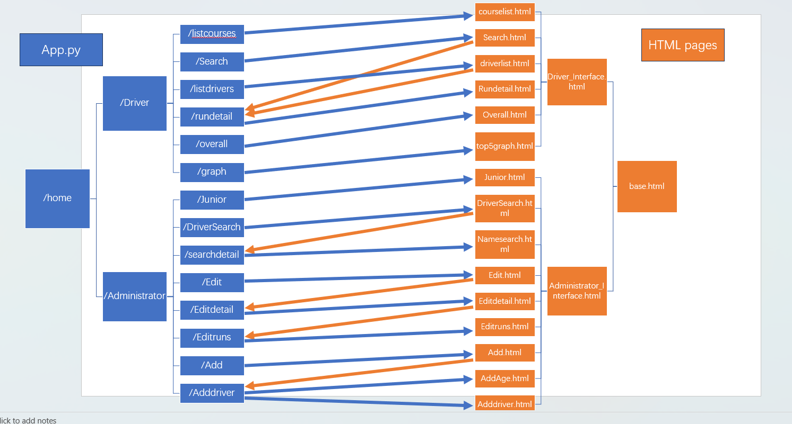

# HaoLiu1157244

Web application structure:

The image below shows the structure of my solution.

The next phragrap will take about date is being passed between each route and temple briefly:

1. /listcourse will send all data of the driver table from the database to courselist.html.
2. /Search  will send some data like driver_id, first name and surname from driver table to Search.html where will send selected dropdown data to /rundetail,
   following sending all run detail data to Rundetail.html.
4. /listdrivers sends all data about drivers from driver table including car model and drive class to driverlist.html where clicking the name will
   send data to /rundetail and show all run details in Rundetail.html.
5. /overall will send all data about run detail including calculated overall result to Overall.html.
6. /graph will two variables drivername and their overall reuslts to top5graph.thml
7. /Junior sends all data about junior drivers to Junior.html
8. /DriverSearch will not send data to DriverSearch.html, but it will post customer data to /searchdetail where will
   generate all data about this name to Namesearch.html.
9. /Edit will send selected dropdown data to Edit.html where will request seconds,cones and wd data to Editdetail.html. it will send those customer edited data to /Editruns where will update these data in database and send them to Editruns.html
10. /Add will request car and birthday data to Add.html. In this page, without birthday data input, it only sends basic input data(name,car model) to Adddriver.html.  with birthday input, it will send birthday data to AddAge.html whenre will send other data like calculated age, caregiver(if age younger than 16) to Adddriver.html. In /Adddriver route, it will generate 12 blank run data for new driver no matter with birthday or without it.

Assumptions and design decisions:

Database questions:

1. CREATE TABLE car (
    car_num INT PRIMARY KEY,
    model VARCHAR(255),
    drive_class VARCHAR(255));

2. ALTER TABLE driver
   ADD FOREIGN KEY (car) REFERENCES car(car_num);

3. Insert into car (car_num,model,drive_class)
   values (11,'Mini','FWD'),(17,'GR Yaris','4WD');

4. ALTER TABLE car
   ALTER COLUMN drive_class SET DEFAULT 'RWD';

5. Providing different routes and access for drivers and club administrators is important to ensure security and data privacy.
   If all of th web facilities were available to everyone, some drivers or users may unintentioanlly edit or  delete other driver's runs result, leading to unfair competition outcomes.
   Another example is that people who are not familiar with this system may flood the system with excessive data or requests, potentially causing performance issues and system crashes.

Image sources:

Cuputo. (2021, Jun 28). drivericon.png.  https://thenounproject.com/icon/racer-4303634/

Sophia. (2018, Jan 17). administratoricon.png. https://thenounproject.com/icon/administrator-1551890/

